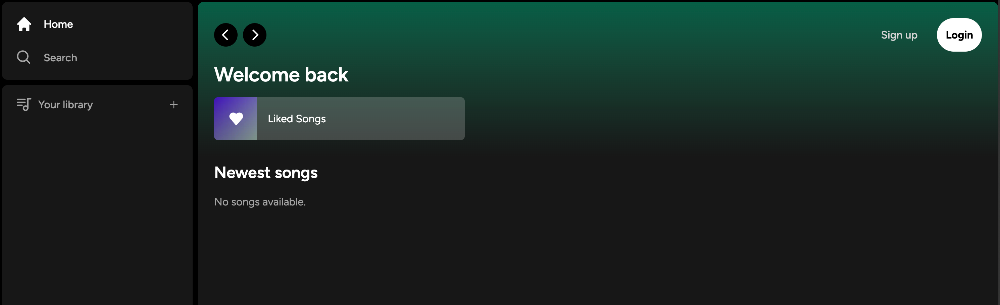

# Spotify Clone | Full Stack Music Streaming | Next.js 13 (App Router)


A pixel-perfect, full-stack music streaming application inspired by Spotify. Built with **Next.js 13 App Router** and **Supabase**, featuring a robust backend for handling audio files, images, and user data. It includes professional payment processing for premium subscriptions via **Stripe** and a modern, responsive UI.

## 🚀 Key Features

- **🎵 Song Upload & Storage:** Users can upload their own mp3 files and cover images, stored securely in Supabase Storage.
- **💳 Stripe Subscriptions:** Full integration with Stripe checkout for recurring "Premium" subscriptions.
- **🔒 Secure Authentication:** OAuth (GitHub) and Email/Password login flows powered by **Supabase Auth**.
- **❤️ Liked Songs System:** Interactive "Like" functionality adding songs to a user's library instantly.
- **🔊 Audio Player:** Custom-built player controls for play/pause, volume, and next/prev track.
- **🎨 Glassmorphism & UI:** Sleek, modern design using **Tailwind CSS** and **Radix UI** primitives.
- **⚡ Server Components:** Leveraging Next.js 13 Server Actions and Server Components for optimal performance and SEO.
- **🗄️ PostgreSQL Database:** Robust data modeling with Supabase's managed Postgres instance.

## 🛠️ Tech Stack

- **Framework:** [Next.js 13](https://nextjs.org/) (App Router, Server Actions)
- **Language:** [TypeScript](https://www.typescriptlang.org/)
- **Styling:** [Tailwind CSS](https://tailwindcss.com/) & [Radix UI](https://www.radix-ui.com/)
- **Backend:** [Supabase](https://supabase.com/) (PostgreSQL, Auth, Storage)
- **State Management:** [Zustand](https://github.com/pmndrs/zustand)
- **Payments:** [Stripe](https://stripe.com/)
- **Forms:** [React Hook Form](https://react-hook-form.com/)
- **Notifications:** [React Hot Toast](https://react-hot-toast.com/)

---

## 🏁 Getting Started

Follow these instructions to set up the project locally.

### Prerequisites

- Node.js 18+
- NPM or Yarn
- A [Supabase](https://supabase.com/) account
- A [Stripe](https://stripe.com/) account

### Installation

1.  **Clone the repository:**

    ```bash
    git clone https://github.com/yourusername/spotify-clone.git
    cd spotify-clone
    ```

2.  **Environment Setup:**
    Create a `.env.local` file in the root directory and add the following keys based on your Supabase and Stripe dashboard:

    ```env
    NEXT_PUBLIC_SUPABASE_URL=your-supabase-url
    NEXT_PUBLIC_SUPABASE_ANON_KEY=your-supabase-anon-key
    SUPABASE_SERVICE_ROLE_KEY=your-supabase-service-role-key

    NEXT_PUBLIC_STRIPE_PUBLISHABLE_KEY=your-stripe-publishable-key
    STRIPE_SECRET_KEY=your-stripe-secret-key
    STRIPE_WEBHOOK_SECRET=your-stripe-webhook-secret
    ```

3.  **Install Dependencies:**

    ```bash
    npm install
    ```

4.  **Database Setup:**
    Copy the SQL schema from `types_db.ts` or run the Supabase migration commands to set up your tables (`songs`, `liked_songs`, etc.).

5.  **Run Development Server:**
    ```bash
    npm run dev
    ```
    Open [http://localhost:3000](http://localhost:3000) in your browser.

## 📸 Screenshots

|             Home Page             |
| :-------------------------------: |
|  |

---

_This project is for educational purposes and is not affiliated with Spotify._
